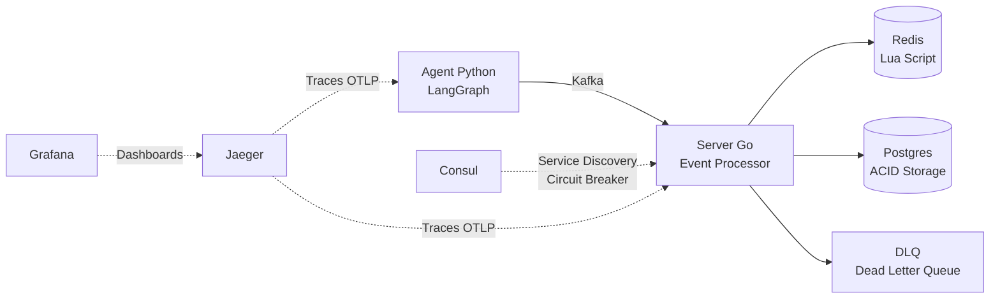
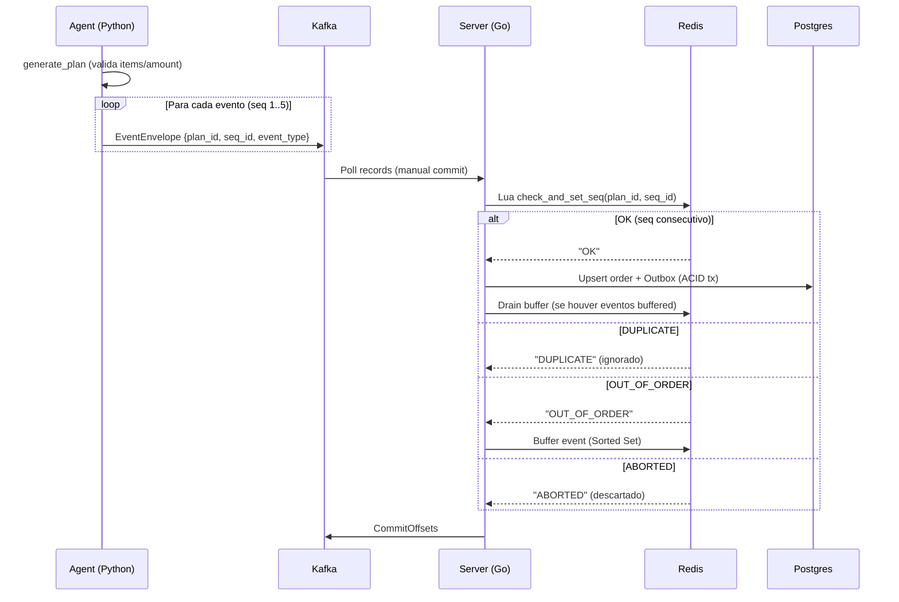

# Nexus Event Gateway

Simulador de sistema distribuido com garantias **Exactly-Once** para processamento de eventos de pedidos.

## Arquitetura



### Fluxo de um Pedido



### Componentes

| Componente | Tech | Responsabilidade |
|---|---|---|
| **Agent** | Python 3.12, LangGraph, Pydantic | Gera planos de eventos com sequenciamento |
| **Server** | Go 1.22, franz-go | Consome Kafka, valida sequencia, persiste |
| **Redis** | Redis 7.2, Lua Script | Atomicidade de sequencia + buffer de reordenacao |
| **Postgres** | PostgreSQL 16 | Source of truth (upsert idempotente) |
| **Consul** | Consul 1.22 | Service discovery + config dinamica CB |
| **Kafka** | Apache Kafka 3.7 | Transporte com manual commit |
| **Jaeger** | OTLP gRPC | Distributed tracing |
| **Grafana** | Dashboards | Metricas e visualizacao de traces |

## Garantias Exactly-Once

O sistema implementa 3 camadas de idempotencia:

1. **Redis Lua Script** (`check_and_set_seq.lua`): Validacao atomica de sequencia — aceita apenas `seq_id == current + 1`
2. **Postgres Upsert**: `WHERE last_seq_processed < EXCLUDED.last_seq_processed` previne duplicatas no banco
3. **Kafka Manual Commit**: Offsets so sao commitados apos processamento completo

## Quick Start

```bash
# Subir toda a infraestrutura
make up

# Verificar se tudo esta saudavel
make status

# Executar o agent (gera 1 pedido completo)
make agent-run

# Verificar resultado no banco
make db-check

# Abrir dashboards
make grafana-open   # http://localhost:3000 (admin/nexus)
make jaeger-open    # http://localhost:16686
```

## Testes

```bash
# Testes unitarios Lua (miniredis, sem infra externa)
make server-test

# Testes de integracao do consumer (requer infra up)
make server-test-integration

# Testes unitarios do Agent Python
make agent-test

# Demo E2E: envia 10 planos e valida Exactly-Once
make demo-e2e

# Demo E2E com 100 planos
make demo-e2e PLANS=100

# Chaos tests (sequence gaps, Redis restart, zombie events)
make chaos-test
```

## Estrutura do Projeto

```
.
├── agent/                   # Agent Python (LangGraph)
│   ├── src/
│   │   ├── planner/         # Grafo LangGraph (nodes, state)
│   │   ├── models/          # Pydantic models (EventEnvelope)
│   │   └── config.py
│   └── tests/               # pytest (unit tests)
├── server/                  # Server Go (Event Processor)
│   ├── cmd/server/          # Entrypoint
│   ├── internal/
│   │   ├── consumer/        # Kafka consumer + sequencing
│   │   ├── redis/           # Redis client + Lua loader
│   │   ├── db/              # Postgres repository
│   │   ├── dlq/             # Dead Letter Queue producer
│   │   └── telemetry/       # OpenTelemetry setup
│   ├── pkg/models/          # Shared models
│   └── scripts/lua/         # check_and_set_seq.lua + tests
├── scripts/
│   ├── chaos_test.py        # Chaos testing scenarios
│   └── e2e_demo.py          # Demo E2E com validacao
├── monitoring/grafana/      # Dashboards + provisioning
├── docker-compose.yml
├── init.sql                 # Schema Postgres
└── Makefile                 # Todos os comandos
```

## Makefile Commands

```bash
make help  # Lista todos os comandos disponiveis
```

### Principais

| Comando | Descricao |
|---|---|
| `make up` | Sobe todos os containers |
| `make down` | Derruba containers |
| `make status` | Status dos containers |
| `make agent-run` | Executa o agent (1 pedido) |
| `make server-test` | Testes unitarios Go (Lua) |
| `make agent-test` | Testes unitarios Python |
| `make demo-e2e` | Demo E2E Exactly-Once |
| `make chaos-test` | Chaos tests completos |

## Fases do Projeto

| Fase | Descricao | Status |
|---|---|---|
| 1 | Kafka + Redis + Postgres | Completa |
| 2 | Agent Python (LangGraph) | Completa |
| 3 | Server Go (Consumer + Lua) | Completa |
| 4 | Consul + Circuit Breaker | Completa |
| 5 | Observabilidade + Chaos Tests | Completa |
| 6 | Qualidade + Demo E2E | Completa |
