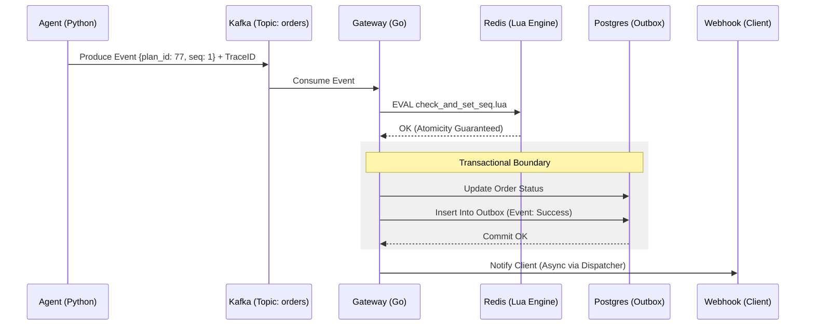

# 🏛️ Blueprint de Engenharia: Nexus Event Gateway (Exactly-Once Architecture)

Este documento descreve a transposição do simulador para uma arquitetura de produção resiliente, agêntica e escalável, focada na garantia de processamento **Exactly-Once** em sistemas distribuídos.

## 1. Escopo e Objetivos

### ✅ Requisitos Funcionais (RF)
- **RF01:** Orquestração de pedidos complexos via Agentes de IA (Planning & Execution).
- **RF02:** Processamento sequencial e idempotente de eventos por `order_id`.
- **RF03:** Garantia de processamento **Exactly-Once** (Exatamente-Uma-Vez).
- **RF04:** Recuperação automática de estado e tratamento de eventos órfãos (DLQ).

### ⚡ Requisitos Não-Funcionais (RNF)
- **RNF01 (Consistência):** Modelo CP (Consistência e Tolerância a Partição) via Scripts Lua e Transações ACID.
- **RNF02 (Escalabilidade):** Suporte a 10.000 eventos/s via Kafka Partitioning e Redis Cluster Hash Tags.
- **RNF03 (Resiliência):** Transaction Outbox Pattern para sincronização entre Postgres e sistemas externos.
- **RNF04 (Observabilidade):** Rastreamento distribuído via OpenTelemetry (Trace Context Propagation).

---

## 2. Stack Tecnológica Refinada

| Camada | Tecnologia | Papel Crítico |
| :--- | :--- | :--- |
| **Agentes (Planner)** | **Python (LangGraph)** | Geração de `plan_id` e injeção de Trace Context. |
| **Core (Server)** | **Go (Golang)** | Consumidor de alta performance com lógica de idempotência atômica. |
| **Mensageria** | **Apache Kafka** | Transporte persistente com ordenação por chave (`order_id`). |
| **Estado Atômico** | **Redis Cluster** | Controle de sequência via **Scripts Lua** para evitar Race Conditions. |
| **Source of Truth** | **PostgreSQL** | Persistência ACID e implementação do **Transaction Outbox Pattern**. |
| **Coordenação** | **Etcd** | Service Discovery e configurações de Circuit Breaker. |

---

## 3. Arquitetura de Idempotência e Resiliência

### A. O Ciclo de Vida do Evento (Exactly-Once)
1.  **Produtor (Agente):** Gera um `plan_id` único e anexa aos eventos `{plan_id, seq_id}`.
2.  **Atomicidade (Redis + Lua):** O servidor Go executa um script Lua no Redis:
    ```lua
    -- Verifica se a seq atual é exatamente a próxima esperada
    local last_seq = redis.call('GET', KEYS[1]) or 0
    if tonumber(ARGV[1]) == tonumber(last_seq) + 1 then
        redis.call('SET', KEYS[1], ARGV[1])
        return 1 -- Prosseguir
    end
    return 0 -- Bloquear/Bufferizar
    ```
3.  **Persistência (Postgres Outbox):** O processamento do pedido e o registro da idempotência ocorrem em uma única transação SQL. Se o commit falhar, o Kafka reprocessará o evento, e o script Lua (ou a tabela de outbox) impedirá a duplicidade.

### B. Tratamento de Caos e Falhas
- **Waiting Room (Buffer):** Eventos fora de ordem são guardados no Redis com **TTL de 1h**. Se a sequência não completar, o evento expira e é enviado para a **DLQ (Dead Letter Queue)**.
- **Tombstones:** O Agente pode enviar um evento de `ABORT_PLAN` que invalida o `plan_id` no Redis, limpando buffers e interrompendo execuções futuras daquele plano.
- **Observabilidade:** Cada salto (Hop) do evento propaga o header `traceparent`, permitindo visualização completa no Jaeger/Grafana.

---

## 4. Diagrama de Fluxo Distribuído



---

## 5. Próximos Passos (Roadmap de Implementação)
1.  [ ] **Infra:** Docker Compose com Kafka (KRaft), Redis Cluster e Postgres.
2.  [ ] **Go Core:** Implementar o Consumer com suporte a Lua Scripts e Outbox.
3.  [ ] **Python Agent:** Implementar o Planner usando LangGraph e injeção de headers Kafka.
4.  [ ] **Dashboard:** Configurar stack de monitoramento (Prometheus/Grafana).

---
*Nexus Event Gateway: Confiabilidade absoluta em um mundo caótico.*
