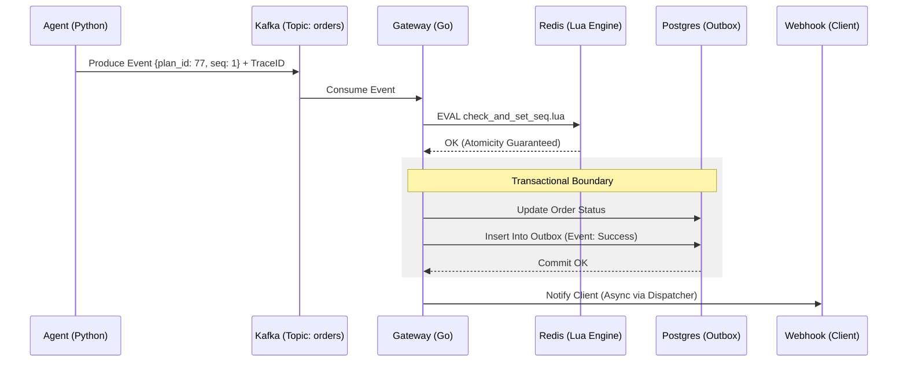

# 🏛️ Blueprint de Engenharia: Nexus Event Gateway (Exactly-Once Architecture)

Este documento descreve a transposição do simulador para uma arquitetura de produção resiliente, agêntica e escalável, focada na garantia de processamento **Exactly-Once** em sistemas distribuídos.

## 1. Escopo e Objetivos

### ✅ Requisitos Funcionais (RF)
- **RF01:** Orquestração de pedidos complexos via Agentes de IA (Planning & Execution).
- **RF02:** Processamento sequencial e idempotente de eventos por `order_id`.
- **RF03:** Garantia de processamento **Exactly-Once** (Exatamente-Uma-Vez).
- **RF04:** Recuperação automática de estado e tratamento de eventos órfãos (DLQ).

### ⚡ Requisitos Não-Funcionais (RNF)
- **RNF01 (Consistência):** Modelo CP (Consistência e Tolerância a Partição) via Scripts Lua e Transações ACID.
- **RNF02 (Escalabilidade):** Suporte a 10.000 eventos/s via Kafka Partitioning e Redis Cluster Hash Tags.
- **RNF03 (Resiliência):** Transaction Outbox Pattern para sincronização entre Postgres e sistemas externos.
- **RNF04 (Observabilidade):** Rastreamento distribuído via OpenTelemetry (Trace Context Propagation).

---

## 2. Stack Tecnológica Refinada

| Camada | Tecnologia | Papel Crítico |
| :--- | :--- | :--- |
| **Agentes (Planner)** | **Python (LangGraph)** | Geração de `plan_id` e injeção de Trace Context. |
| **Core (Server)** | **Go (Golang)** | Consumidor de alta performance com lógica de idempotência atômica. |
| **Mensageria** | **Apache Kafka** | Transporte persistente com ordenação por chave (`order_id`). |
| **Estado Atômico** | **Redis Cluster** | Controle de sequência via **Scripts Lua** para evitar Race Conditions. |
| **Source of Truth** | **PostgreSQL** | Persistência ACID e implementação do **Transaction Outbox Pattern**. |
| **Coordenação** | **Consul** | Service Discovery, Health Checks e configurações de Circuit Breaker. |

---

## 3. Arquitetura de Idempotência e Resiliência

### A. O Ciclo de Vida do Evento (Exactly-Once)
1.  **Produtor (Agente):** Gera um `plan_id` único e anexa aos eventos `{plan_id, seq_id}`.
2.  **Atomicidade (Redis + Lua):** O servidor Go executa um script Lua no Redis:
    ```lua
    -- Verifica se a seq atual é exatamente a próxima esperada
    local last_seq = redis.call('GET', KEYS[1]) or 0
    if tonumber(ARGV[1]) == tonumber(last_seq) + 1 then
        redis.call('SET', KEYS[1], ARGV[1])
        return 1 -- Prosseguir
    end
    return 0 -- Bloquear/Bufferizar
    ```
3.  **Persistência (Postgres Outbox):** O processamento do pedido e o registro da idempotência ocorrem em uma única transação SQL. Se o commit falhar, o Kafka reprocessará o evento, e o script Lua (ou a tabela de outbox) impedirá a duplicidade.

### B. Tratamento de Caos e Falhas
- **Waiting Room (Buffer):** Eventos fora de ordem são guardados no Redis com **TTL de 1h**. Se a sequência não completar, o evento expira e é enviado para a **DLQ (Dead Letter Queue)**.
- **Tombstones:** O Agente pode enviar um evento de `ABORT_PLAN` que invalida o `plan_id` no Redis, limpando buffers e interrompendo execuções futuras daquele plano.
- **Observabilidade:** Cada salto (Hop) do evento propaga o header `traceparent`, permitindo visualização completa no Jaeger/Grafana.

---

## 4. Diagrama de Fluxo Distribuído



---

## 5. Próximos Passos (Roadmap de Implementação)
1.  [ ] **Infra:** Docker Compose com Kafka (KRaft), Redis Cluster e Postgres.
2.  [ ] **Go Core:** Implementar o Consumer com suporte a Lua Scripts e Outbox.
3.  [ ] **Python Agent:** Implementar o Planner usando LangGraph e injeção de headers Kafka.
4.  [ ] **Dashboard:** Configurar stack de monitoramento (Prometheus/Grafana).

---

## 6. Registro de Decisoes Arquiteturais (ADR)

### ADR-001: Go Client Kafka — franz-go ao inves de confluent-kafka-go/sarama

- **Data:** 2026-02-28
- **Contexto:** O blueprint original listava `confluent-kafka-go` ou `sarama` como opcoes para o consumer Kafka em Go.
- **Decisao:** Adotar **franz-go** como client Kafka.
- **Razao:** franz-go e puro Go (sem dependencia de librdkafka em C), 4x mais rapido no producing e ate 10-20x no consuming comparado a confluent-kafka-go. Sarama esta abandonado. franz-go tem suporte completo a transacoes, regex topic consuming e metricas Prometheus via plugins.
- **Trade-off:** Menor base de usuarios que confluent-kafka-go, porem comunidade ativa e feature-complete.

### ADR-002: Consul ao inves de Etcd para coordenacao

- **Data:** 2026-02-28
- **Contexto:** O blueprint original definia Etcd para Service Discovery e Circuit Breaker. O projeto roda em Docker Compose, sem Kubernetes no escopo atual.
- **Decisao:** Substituir **Etcd** por **Consul**.
- **Razao:** Em ambiente Docker Compose, Etcd nao oferece vantagens — ele brilha como backend nativo do Kubernetes (onde ja vem embutido e "de graca"). Consul oferece: health checks nativos (essencial para Circuit Breaker), service discovery via DNS, Web UI para debugging, e service mesh (Consul Connect) caso o projeto escale. Ambos usam Raft para consenso e garantem consistencia forte (CP).
- **Trade-off:** Se o projeto migrar para Kubernetes no futuro, Etcd ja estaria disponivel sem custo adicional. Consul precisaria rodar como servico separado dentro do cluster K8s. A decisao prioriza o cenario atual (Docker Compose) sobre um cenario futuro hipotetico.

### ADR-003: Validacao das demais stacks — mantidas conforme blueprint original

- **Data:** 2026-02-28
- **Contexto:** Pesquisa tecnica comparativa realizada para todas as camadas da arquitetura.
- **Decisao:** Manter **Go**, **LangGraph**, **Kafka**, **Redis + Lua** e **PostgreSQL** conforme definidos originalmente.
- **Razao por camada:**
  - **Go:** Melhor equilibrio performance/produtividade para workloads I/O-bound (Kafka consumer). Rust teria ~30% mais performance e 2-4x menos memoria, mas complexidade de desenvolvimento nao se justifica. Java tem overhead de memoria e latencia de startup.
  - **LangGraph:** Grafo de estados e o modelo correto para gerar sequencias deterministicas de eventos com `plan_id`/`seq_id`. CrewAI (role-based) e AutoGen (conversacional) nao se adequam. Tendencia de mercado 2026 converge para modelos baseados em grafos.
  - **Kafka:** Exactly-once semantics mais maduras do mercado. KRaft eliminou dependencia do ZooKeeper. NATS nao tem exactly-once nativo (desqualificado para RF03). Pulsar e alternativa valida mas adiciona complexidade operacional (BookKeeper). Redpanda e promissor mas tem caveats de performance em producao prolongada.
  - **Redis + Lua:** Unica opcao que combina atomicidade total, latencia sub-ms e +30% throughput vs comandos separados. Hash tags garantem co-localizacao de chaves por `order_id` no cluster.
  - **PostgreSQL:** Unico RDBMS necessario para Transaction Outbox Pattern com ACID. Sem alternativas a considerar.
- **Referencia:** Relatorio completo em `_bmad-output/planning-artifacts/research/technical-stack-validation-research-2026-02-28.md`

---
*Nexus Event Gateway: Confiabilidade absoluta em um mundo caótico.*
