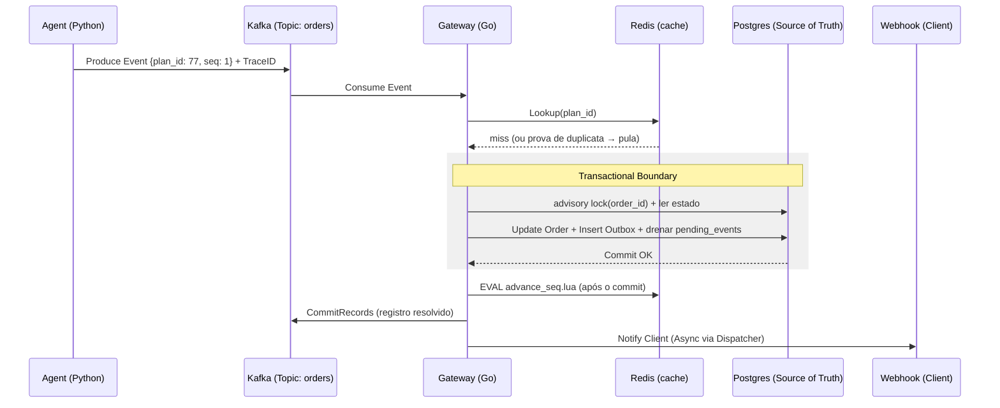

# 🏛️ Blueprint de Engenharia: Nexus Event Gateway (Exactly-Once Architecture)

Este documento descreve a transposição do simulador para uma arquitetura de produção resiliente, agêntica e escalável, focada na garantia de processamento **Exactly-Once** em sistemas distribuídos.

## 1. Escopo e Objetivos

### ✅ Requisitos Funcionais (RF)
- **RF01:** Orquestração de pedidos complexos via Agentes de IA (Planning & Execution).
- **RF02:** Processamento sequencial e idempotente de eventos por `order_id`.
- **RF03:** Garantia de processamento **Exactly-Once** (Exatamente-Uma-Vez).
- **RF04:** Recuperação automática de estado e tratamento de eventos órfãos (DLQ).

### ⚡ Requisitos Não-Funcionais (RNF)
- **RNF01 (Consistência):** Modelo CP (Consistência e Tolerância a Partição) via transação ACID no Postgres, serializada por pedido (ADR-004).
- **RNF02 (Escalabilidade):** Suporte a 10.000 eventos/s via particionamento Kafka por `order_id`; o teto passa a ser a capacidade de escrita do Postgres (ADR-004).
- **RNF03 (Resiliência):** Transaction Outbox Pattern para sincronização entre Postgres e sistemas externos.
- **RNF04 (Observabilidade):** Rastreamento distribuído via OpenTelemetry (Trace Context Propagation).

---

## 2. Stack Tecnológica Refinada

| Camada | Tecnologia | Papel Crítico |
| :--- | :--- | :--- |
| **Agentes (Planner)** | **Python (LangGraph)** | Geração de `plan_id` e injeção de Trace Context. |
| **Core (Server)** | **Go (Golang)** | Consumidor de alta performance com lógica de idempotência atômica. |
| **Mensageria** | **Apache Kafka** | Transporte persistente com ordenação por chave (`order_id`). |
| **Cache de Sequência** | **Redis** | Cache monotônico do progresso de cada plano (**Script Lua**). Opcional: só serve para pular trabalho. |
| **Source of Truth** | **PostgreSQL** | Decisão de sequência, buffer de reordenação e **Transaction Outbox Pattern**, tudo na mesma transação. |
| **Coordenação** | **Consul** | Service Discovery, Health Checks e configurações de Circuit Breaker. |

---

## 3. Arquitetura de Idempotência e Resiliência

### A. O Ciclo de Vida do Evento (Exactly-Once)
1.  **Produtor (Agente):** Gera um `plan_id` único e anexa aos eventos `{plan_id, seq_id}`.
2.  **Decisão transacional (Postgres):** O servidor Go abre uma transação e pega `pg_advisory_xact_lock` do `order_id`, o que serializa todos os escritores do pedido, inclusive antes de a linha existir. Com o estado lido (`last_seq_processed`, `status`, `plan_id`), as regras de `internal/sequencing` decidem:
    - `APPLY` (`seq == last_seq + 1`): atualiza o pedido, grava o outbox e drena de `pending_events` os eventos consecutivos, tudo na mesma transação;
    - `BUFFER` (gap): grava em `pending_events`;
    - `DUPLICATE` / `DISCARD` (plano abortado): nada a gravar;
    - `PLAN_MISMATCH` (outro plano para o mesmo pedido): DLQ.
3.  **Commit Kafka só do que foi resolvido:** erro transitório (banco fora, timeout) é retentado no lugar com backoff, sem pular o registro. Só vai para a DLQ o que nunca vai funcionar, e o offset só é commitado depois do ack da DLQ. Reentregas são inofensivas porque a decisão do passo 2 é idempotente.
4.  **Cache (Redis + Lua):** Depois do commit, `advance_seq.lua` avança `seq:<plan_id>`, e nunca para trás. O cache pode ficar atrás do Postgres, mas nunca à frente, e por isso só é usado para *pular* duplicatas e planos abortados. Perder o Redis não afeta a corretude.

### B. Tratamento de Caos e Falhas
- **Waiting Room (Buffer):** Eventos fora de ordem ficam em `pending_events` (Postgres). Um sweeper envia para a **DLQ (Dead Letter Queue)** os que esperam mais de **1h** pelo antecessor, e só os remove depois do ack da DLQ.
- **DLQ:** Recebe só o que nunca vai funcionar (JSON malformado, envelope inválido, dado rejeitado pelo banco, plano divergente, buffer expirado). O envio espera o ack do broker, e só então o offset de origem é commitado. O producer cria o tópico `orders-dlq` sob demanda, o que exige `auto.create.topics.enable=true` no broker (ligado no compose); sem o tópico, a partição de origem fica parada em retry em vez de perder o evento.
- **Entrega de webhooks (outbox):** *at-least-once* com `Idempotency-Key`. Só a notificação pendente mais antiga de cada pedido pode ser entregue, então a ordem por pedido é mantida sem que um pedido com falha atrase os outros. O retry é agendado no banco (`next_attempt_at`, backoff exponencial), 4xx vai para dead-letter na hora e o lease com `FOR UPDATE SKIP LOCKED` evita entregas simultâneas entre instâncias (ADR-005).
- **Tombstones:** `ABORT_PLAN` marca o pedido como `aborted` e descarta o buffer do plano na mesma transação. Se chega antes de qualquer evento, grava um tombstone para descartar os eventos que chegarem depois. Pedido `completed` é terminal e ignora o abort.
- **Observabilidade:** Cada salto (Hop) do evento propaga o header `traceparent`, permitindo visualização completa no Jaeger/Grafana.

---

## 4. Diagrama de Fluxo Distribuído

```mermaid
sequenceDiagram
    participant A as Agent (Python)
    participant K as Kafka (Topic: orders)
    participant G as Gateway (Go)
    participant R as Redis (cache)
    participant DB as Postgres (Source of Truth)
    participant W as Webhook (Client)

    A->>K: Produce Event {plan_id: 77, seq: 1} + TraceID
    K->>G: Consume Event
    G->>R: Lookup(plan_id)
    R-->>G: miss (ou prova de duplicata → pula)

    rect rgb(240, 240, 240)
        Note over G,DB: Transactional Boundary
        G->>DB: advisory lock(order_id) + ler estado
        G->>DB: Update Order + Insert Outbox + drenar pending_events
        DB-->>G: Commit OK
    end

    G->>R: EVAL advance_seq.lua (após o commit)
    G->>K: CommitRecords (registro resolvido)
    G->>W: Notify Client (Async via Dispatcher)
```

---

## 5. Status do Roadmap

O acompanhamento detalhado fica em [`docs/tasks.md`](tasks.md).

1.  [x] **Infra:** Docker Compose com Kafka (KRaft), Redis e Postgres. O Redis roda como nó único; o Redis Cluster previsto no blueprint original não foi adotado e deixou de ser requisito com o ADR-004.
2.  [x] **Go Core:** Consumer com decisão de sequência transacional no Postgres e Outbox (ADR-004).
3.  [x] **Python Agent:** Planner com LangGraph e injeção de headers Kafka (`traceparent`).
4.  [ ] **Dashboard:** Grafana + Jaeger (traces) prontos. Faltam métricas: o server ainda não expõe contadores (DLQ, duplicatas, buffer, estado do circuit breaker, consumer lag) nem há Prometheus.

---

## 6. Registro de Decisoes Arquiteturais (ADR)

### ADR-001: Go Client Kafka — franz-go ao inves de confluent-kafka-go/sarama

- **Data:** 2026-02-28
- **Contexto:** O blueprint original listava `confluent-kafka-go` ou `sarama` como opcoes para o consumer Kafka em Go.
- **Decisao:** Adotar **franz-go** como client Kafka.
- **Razao:** franz-go e puro Go (sem dependencia de librdkafka em C), 4x mais rapido no producing e ate 10-20x no consuming comparado a confluent-kafka-go. Sarama esta abandonado. franz-go tem suporte completo a transacoes, regex topic consuming e metricas Prometheus via plugins.
- **Trade-off:** Menor base de usuarios que confluent-kafka-go, porem comunidade ativa e feature-complete.

### ADR-002: Consul ao inves de Etcd para coordenacao

- **Data:** 2026-02-28
- **Contexto:** O blueprint original definia Etcd para Service Discovery e Circuit Breaker. O projeto roda em Docker Compose, sem Kubernetes no escopo atual.
- **Decisao:** Substituir **Etcd** por **Consul**.
- **Razao:** Em ambiente Docker Compose, Etcd nao oferece vantagens — ele brilha como backend nativo do Kubernetes (onde ja vem embutido e "de graca"). Consul oferece: health checks nativos (essencial para Circuit Breaker), service discovery via DNS, Web UI para debugging, e service mesh (Consul Connect) caso o projeto escale. Ambos usam Raft para consenso e garantem consistencia forte (CP).
- **Trade-off:** Se o projeto migrar para Kubernetes no futuro, Etcd ja estaria disponivel sem custo adicional. Consul precisaria rodar como servico separado dentro do cluster K8s. A decisao prioriza o cenario atual (Docker Compose) sobre um cenario futuro hipotetico.

### ADR-003: Validacao das demais stacks — mantidas conforme blueprint original

- **Data:** 2026-02-28
- **Status:** Parcialmente substituido pelo ADR-004 (papel do Redis + Lua).
- **Contexto:** Pesquisa tecnica comparativa realizada para todas as camadas da arquitetura.
- **Decisao:** Manter **Go**, **LangGraph**, **Kafka**, **Redis + Lua** e **PostgreSQL** conforme definidos originalmente.
- **Razao por camada:**
  - **Go:** Melhor equilibrio performance/produtividade para workloads I/O-bound (Kafka consumer). Rust teria ~30% mais performance e 2-4x menos memoria, mas complexidade de desenvolvimento nao se justifica. Java tem overhead de memoria e latencia de startup.
  - **LangGraph:** Grafo de estados e o modelo correto para gerar sequencias deterministicas de eventos com `plan_id`/`seq_id`. CrewAI (role-based) e AutoGen (conversacional) nao se adequam. Tendencia de mercado 2026 converge para modelos baseados em grafos.
  - **Kafka:** Exactly-once semantics mais maduras do mercado. KRaft eliminou dependencia do ZooKeeper. NATS nao tem exactly-once nativo (desqualificado para RF03). Pulsar e alternativa valida mas adiciona complexidade operacional (BookKeeper). Redpanda e promissor mas tem caveats de performance em producao prolongada.
  - **Redis + Lua:** Unica opcao que combina atomicidade total, latencia sub-ms e +30% throughput vs comandos separados. Hash tags garantem co-localizacao de chaves por `order_id` no cluster.
  - **PostgreSQL:** Unico RDBMS necessario para Transaction Outbox Pattern com ACID. Sem alternativas a considerar.
- **Referencia:** Relatorio completo em `_bmad-output/planning-artifacts/research/technical-stack-validation-research-2026-02-28.md`

### ADR-004: Postgres como fonte de verdade da sequencia; Redis vira cache

- **Data:** 2026-09-23
- **Status:** Aceito. Substitui a parte "Redis + Lua" do ADR-003.
- **Contexto:** O ADR-003 avaliou a atomicidade *dentro* do Redis, mas o risco estava *entre* Redis e Postgres. O `check_and_set_seq.lua` avancava `seq:<plan_id>` antes do commit no Postgres. Se o commit falhasse, o evento ia para a DLQ, o offset era commitado, e o evento seguinte era aceito por cima do gap: um passo do pedido se perdia sem nenhum aviso. Alem disso, o Redis rodava sem persistencia, entao um restart zerava os contadores e travava os planos em andamento ate o TTL do buffer.
- **Decisao:**
  - A decisao de sequencia acontece numa transacao no Postgres, serializada por `pg_advisory_xact_lock(order_id)`. O buffer de reordenacao vira a tabela `pending_events` e e drenado na mesma transacao que aplica o evento.
  - Redis vira cache monotonico (`advance_seq.lua`): e escrito so depois do commit e usado apenas para pular duplicatas e planos abortados.
  - O offset Kafka so e commitado para registros resolvidos; erro transitorio e retentado no lugar; a DLQ espera o ack do broker.
- **Razao:** Uma unica fonte de verdade elimina o dual-write: qualquer falha dentro da transacao nao deixa efeito parcial. Advisory lock em vez de `SELECT ... FOR UPDATE` porque a linha do pedido pode ainda nao existir quando o primeiro evento (ou um evento fora de ordem) chega.
- **Trade-offs:**
  - Cada evento novo custa uma transacao com lock no Postgres (1-5 ms segundo a pesquisa), contra sub-ms no Redis. Na pratica o custo quase nao muda: o Postgres ja estava no caminho de todo evento aplicado (upsert + outbox), e o Redis so acrescentava um hop.
  - O retry no lugar bloqueia a particao enquanto o banco estiver fora. E intencional: avancar violaria a ordem.
  - Redis Cluster e hash tags deixam de ser requisito de corretude; a escala de escrita passa a depender do Postgres.
- **Consequencias:** Perder o Redis, ou ele ficar fora do ar, nao afeta a corretude nem para o processamento, e o `/health` passa a depender so do Postgres. A corretude e coberta por testes de integracao contra Postgres real (schema isolado criado a partir do `init.sql`), incluindo entregas concorrentes do mesmo evento.

### ADR-005: Entrega de webhooks at-least-once, em ordem por pedido

- **Data:** 2026-09-24
- **Status:** Aceito.
- **Contexto:** O dispatcher do outbox buscava 50 entradas e, para cada uma, retentava no lugar com `sleep` (5s, 10s). Uma entrada que falhava era pulada, e as seguintes do mesmo pedido eram entregues antes dela: o cenário de chaos registrou um pedido recebido como `[2, 3, 4, 5, 1]`. Além disso, 4xx era retentado, não havia `Idempotency-Key`, duas instâncias entregavam a mesma entrada (sem `SKIP LOCKED`) e a entrega nunca era exercitada, porque o compose não tinha receptor.
- **Decisao:**
  - Entrega *at-least-once* com `Idempotency-Key` = ID da entrada do outbox. Exactly-once não é possível através de HTTP: o dispatcher pode morrer entre a resposta e o registro. A deduplicação fica com o receptor.
  - Só a entrada pendente mais antiga de cada pedido (a "cabeça") é elegível. Isso garante a ordem por pedido; pedidos diferentes são entregues em paralelo.
  - Reivindicação com `FOR UPDATE SKIP LOCKED` e lease (`lease_until`, 1 min). Um lease abandonado por uma instância que morreu expira e a entrada volta a ser elegível.
  - Retry agendado no banco (`attempts`, `next_attempt_at`, backoff exponencial de 1s até 1 min), sem `sleep` no dispatcher. 5xx, 408, 429 e erro de rede são retentáveis; após `WEBHOOK_MAX_ATTEMPTS` (10) a entrada vai para dead-letter (`dead_at`).
  - Qualquer outro 4xx vai para dead-letter na primeira tentativa: o receptor recusou a notificação e tentar de novo não muda isso.
  - Com o circuit breaker aberto nada é reivindicado; entradas não tentadas (circuito semiaberto, shutdown) são devolvidas sem contar tentativa.
- **Trade-offs:**
  - **Dead-letter não bloqueia o pedido:** depois que uma notificação vai para dead-letter, as seguintes do mesmo pedido são entregues. Bloquear o pedido para sempre por causa de uma notificação recusada seria pior para o receptor do que um buraco explícito, registrado no outbox (`dead_at`, `last_error`) e reprocessável. É a única situação em que a ordem por pedido não é garantida.
  - A entrega de um pedido é sequencial: com N notificações, são N idas ao banco e N requisições em série. O dispatcher volta a consultar o outbox logo após uma entrega, sem esperar o intervalo de poll, para que isso não custe N intervalos.
- **Consequencias:** O compose ganha o `webhook-sink` (receptor de teste com falhas injetáveis), e o chaos test ganha o cenário "Webhook Delivery". Esse cenário falha na versão anterior do dispatcher (entregas sem `Idempotency-Key`, 4xx retentado, ordem `[2, 3, 4, 5, 1]`) e passa nesta. Os testes de integração do dispatcher rodam contra Postgres real e cobrem ordem, isolamento entre pedidos, dead-letter, lease expirado, circuito aberto, shutdown e duas instâncias concorrentes.
---
*Nexus Event Gateway: Confiabilidade absoluta em um mundo caótico.*
