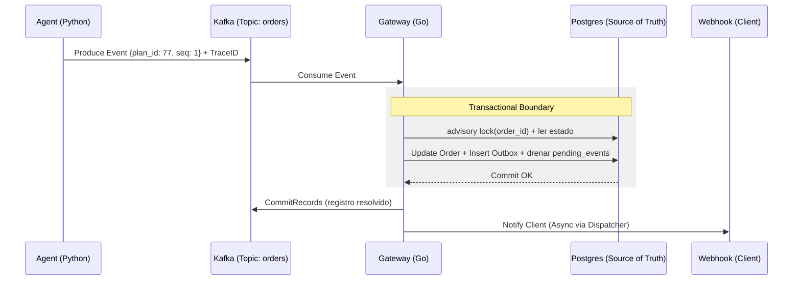

# 🏛️ Blueprint de Engenharia: Nexus Event Gateway

O Nexus é um gateway de **execução segura de planos de agentes de IA**. O agente propõe os passos de um processo (aqui, um pedido de e-commerce); o gateway decide, numa transação, se cada passo é válido, aplica uma vez e na ordem, e avisa o mundo externo uma vez e na ordem. O gateway não confia no agente: agentes repetem ações, se perdem no meio, reiniciam e alucinam passos, e nenhuma dessas falhas pode virar um efeito duplicado ou fora de ordem.

A tese, o catálogo de falhas de agente e o roteiro estão no ADR-007. O que já está coberto e o que ainda não está fica explícito lá.

## 1. Escopo e Objetivos

### ✅ Requisitos Funcionais (RF)
- **RF01:** Execução de planos gerados por agentes de IA, sem confiar no agente (ADR-007).
- **RF02:** Processamento sequencial e idempotente de eventos por `order_id`.
- **RF03:** Cada evento aplicado no Postgres exatamente uma vez (*effectively-once*); efeitos externos entregues pelo menos uma vez, com `Idempotency-Key` para o receptor deduplicar (ADR-005). *Exactly-once* de ponta a ponta através de HTTP não existe, e o projeto não promete.
- **RF04:** Recuperação automática de estado e tratamento de eventos órfãos (DLQ).

### ⚡ Requisitos Não-Funcionais (RNF)
- **RNF01 (Consistência):** Modelo CP (Consistência e Tolerância a Partição) via transação ACID no Postgres, serializada por pedido (ADR-004).
- **RNF02 (Escalabilidade):** Suporte a 10.000 eventos/s via particionamento Kafka por `order_id`; o teto passa a ser a capacidade de escrita do Postgres (ADR-004).
- **RNF03 (Resiliência):** Transaction Outbox Pattern para sincronização entre Postgres e sistemas externos.
- **RNF04 (Observabilidade):** Rastreamento distribuído via OpenTelemetry (Trace Context Propagation) e métricas Prometheus com dashboard no Grafana (ADR-006).

---

## 2. Stack Tecnológica Refinada

| Camada | Tecnologia | Papel Crítico |
| :--- | :--- | :--- |
| **Agentes (Planner)** | **Python (LangGraph)** | Geração de `plan_id` e injeção de Trace Context. |
| **Core (Server)** | **Go (Golang)** | Consumidor que decide cada passo numa transação e entrega os efeitos pelo outbox. |
| **Mensageria** | **Apache Kafka** | Transporte persistente com ordenação por chave (`order_id`). |
| **Source of Truth** | **PostgreSQL** | Decisão de sequência, buffer de reordenação e **Transaction Outbox Pattern**, tudo na mesma transação. |

Redis e Consul fizeram parte da stack até o ADR-008.

---

## 3. Arquitetura de Idempotência e Resiliência

### A. O Ciclo de Vida do Evento
1.  **Produtor (Agente):** Gera um `plan_id` único e anexa aos eventos `{plan_id, seq_id}`.
2.  **Decisão transacional (Postgres):** O servidor Go abre uma transação e pega `pg_advisory_xact_lock` do `order_id`, o que serializa todos os escritores do pedido, inclusive antes de a linha existir. Com o estado lido (`last_seq_processed`, `status`, `plan_id`), as regras de `internal/sequencing` decidem:
    - `APPLY` (`seq == last_seq + 1`): atualiza o pedido, grava o outbox e drena de `pending_events` os eventos consecutivos, tudo na mesma transação;
    - `BUFFER` (gap): grava em `pending_events`;
    - `DUPLICATE` / `DISCARD` (plano abortado): nada a gravar;
    - `PLAN_MISMATCH` (outro plano para o mesmo pedido): DLQ.
3.  **Commit Kafka só do que foi resolvido:** erro transitório (banco fora, timeout) é retentado no lugar com backoff, sem pular o registro. Só vai para a DLQ o que nunca vai funcionar, e o offset só é commitado depois do ack da DLQ. Reentregas, inclusive depois de um crash do server, são inofensivas porque a decisão do passo 2 é idempotente.

### B. Tratamento de Caos e Falhas
- **Waiting Room (Buffer):** Eventos fora de ordem ficam em `pending_events` (Postgres). Um sweeper envia para a **DLQ (Dead Letter Queue)** os que esperam mais de **1h** pelo antecessor, e só os remove depois do ack da DLQ.
- **DLQ:** Recebe só o que nunca vai funcionar (JSON malformado, envelope inválido, dado rejeitado pelo banco, plano divergente, buffer expirado). O envio espera o ack do broker, e só então o offset de origem é commitado. O producer cria o tópico `orders-dlq` sob demanda, o que exige `auto.create.topics.enable=true` no broker (ligado no compose); sem o tópico, a partição de origem fica parada em retry em vez de perder o evento.
- **Entrega de webhooks (outbox):** *at-least-once* com `Idempotency-Key`. Só a notificação pendente mais antiga de cada pedido pode ser entregue, então a ordem por pedido é mantida sem que um pedido com falha atrase os outros. O retry é agendado no banco (`next_attempt_at`, backoff exponencial), 4xx vai para dead-letter na hora e o lease com `FOR UPDATE SKIP LOCKED` evita entregas simultâneas entre instâncias (ADR-005).
- **Tombstones:** `ABORT_PLAN` marca o pedido como `aborted` e descarta o buffer do plano na mesma transação. Se chega antes de qualquer evento, grava um tombstone para descartar os eventos que chegarem depois. Pedido `completed` é terminal e ignora o abort.
- **Observabilidade:** Cada salto (Hop) do evento propaga o header `traceparent`, permitindo visualização completa no Jaeger/Grafana.

---

## 4. Diagrama de Fluxo Distribuído

```mermaid
sequenceDiagram
    participant A as Agent (Python)
    participant K as Kafka (Topic: orders)
    participant G as Gateway (Go)
    participant DB as Postgres (Source of Truth)
    participant W as Webhook (Client)

    A->>K: Produce Event {plan_id: 77, seq: 1} + TraceID
    K->>G: Consume Event

    rect rgb(240, 240, 240)
        Note over G,DB: Transactional Boundary
        G->>DB: advisory lock(order_id) + ler estado
        G->>DB: Update Order + Insert Outbox + drenar pending_events
        DB-->>G: Commit OK
    end

    G->>K: CommitRecords (registro resolvido)
    G->>W: Notify Client (Async via Dispatcher)
```

---

## 5. Status do Roadmap

O acompanhamento detalhado fica em [`docs/tasks.md`](tasks.md).

1.  [x] **Infra:** Docker Compose com Kafka (KRaft) e Postgres. Redis e Consul saíram com o ADR-008.
2.  [x] **Go Core:** Consumer com decisão de sequência transacional no Postgres e Outbox (ADR-004).
3.  [x] **Python Agent:** Planner com LangGraph e injeção de headers Kafka (`traceparent`). Publica cada evento assim que o node o gera, com ack do broker, e simula falhas de estoque e pagamento (reproduzíveis por seed) que terminam em `ABORT_PLAN`.
4.  [x] **Dashboard:** Grafana com traces (Jaeger) e métricas (Prometheus): desfechos do sequenciamento, DLQ, buffer, consumer lag, entregas de webhook, circuit breaker e backlog do outbox (ADR-006).
5.  [ ] **Execução segura de planos de agentes:** roteiro em seis fases no ADR-007 (Fases 12 a 17 em `docs/tasks.md`).

---

## 6. Registro de Decisoes Arquiteturais (ADR)

### ADR-001: Go Client Kafka — franz-go ao inves de confluent-kafka-go/sarama

- **Data:** 2026-02-28
- **Contexto:** O blueprint original listava `confluent-kafka-go` ou `sarama` como opcoes para o consumer Kafka em Go.
- **Decisao:** Adotar **franz-go** como client Kafka.
- **Razao:** franz-go e puro Go (sem dependencia de librdkafka em C), 4x mais rapido no producing e ate 10-20x no consuming comparado a confluent-kafka-go. Sarama esta abandonado. franz-go tem suporte completo a transacoes, regex topic consuming e metricas Prometheus via plugins.
- **Trade-off:** Menor base de usuarios que confluent-kafka-go, porem comunidade ativa e feature-complete.

### ADR-002: Consul ao inves de Etcd para coordenacao

- **Data:** 2026-02-28
- **Status:** Substituido pelo ADR-008 (Consul removido).
- **Contexto:** O blueprint original definia Etcd para Service Discovery e Circuit Breaker. O projeto roda em Docker Compose, sem Kubernetes no escopo atual.
- **Decisao:** Substituir **Etcd** por **Consul**.
- **Razao:** Em ambiente Docker Compose, Etcd nao oferece vantagens — ele brilha como backend nativo do Kubernetes (onde ja vem embutido e "de graca"). Consul oferece: health checks nativos (essencial para Circuit Breaker), service discovery via DNS, Web UI para debugging, e service mesh (Consul Connect) caso o projeto escale. Ambos usam Raft para consenso e garantem consistencia forte (CP).
- **Trade-off:** Se o projeto migrar para Kubernetes no futuro, Etcd ja estaria disponivel sem custo adicional. Consul precisaria rodar como servico separado dentro do cluster K8s. A decisao prioriza o cenario atual (Docker Compose) sobre um cenario futuro hipotetico.

### ADR-003: Validacao das demais stacks — mantidas conforme blueprint original

- **Data:** 2026-02-28
- **Status:** Parcialmente substituido pelo ADR-004 (papel do Redis + Lua) e pelo ADR-008 (Redis removido).
- **Contexto:** Pesquisa tecnica comparativa realizada para todas as camadas da arquitetura.
- **Decisao:** Manter **Go**, **LangGraph**, **Kafka**, **Redis + Lua** e **PostgreSQL** conforme definidos originalmente.
- **Razao por camada:**
  - **Go:** Melhor equilibrio performance/produtividade para workloads I/O-bound (Kafka consumer). Rust teria ~30% mais performance e 2-4x menos memoria, mas complexidade de desenvolvimento nao se justifica. Java tem overhead de memoria e latencia de startup.
  - **LangGraph:** Grafo de estados e o modelo correto para gerar sequencias deterministicas de eventos com `plan_id`/`seq_id`. CrewAI (role-based) e AutoGen (conversacional) nao se adequam. Tendencia de mercado 2026 converge para modelos baseados em grafos.
  - **Kafka:** Exactly-once semantics mais maduras do mercado. KRaft eliminou dependencia do ZooKeeper. NATS nao tem exactly-once nativo (desqualificado para RF03). Pulsar e alternativa valida mas adiciona complexidade operacional (BookKeeper). Redpanda e promissor mas tem caveats de performance em producao prolongada.
  - **Redis + Lua:** Unica opcao que combina atomicidade total, latencia sub-ms e +30% throughput vs comandos separados. Hash tags garantem co-localizacao de chaves por `order_id` no cluster.
  - **PostgreSQL:** Unico RDBMS necessario para Transaction Outbox Pattern com ACID. Sem alternativas a considerar.
- **Referencia:** Relatorio completo em `_bmad-output/planning-artifacts/research/technical-stack-validation-research-2026-02-28.md`

### ADR-004: Postgres como fonte de verdade da sequencia; Redis vira cache

- **Data:** 2026-09-23
- **Status:** Aceito. Substitui a parte "Redis + Lua" do ADR-003. O cache Redis que ele manteve foi removido pelo ADR-008.
- **Contexto:** O ADR-003 avaliou a atomicidade *dentro* do Redis, mas o risco estava *entre* Redis e Postgres. O `check_and_set_seq.lua` avancava `seq:<plan_id>` antes do commit no Postgres. Se o commit falhasse, o evento ia para a DLQ, o offset era commitado, e o evento seguinte era aceito por cima do gap: um passo do pedido se perdia sem nenhum aviso. Alem disso, o Redis rodava sem persistencia, entao um restart zerava os contadores e travava os planos em andamento ate o TTL do buffer.
- **Decisao:**
  - A decisao de sequencia acontece numa transacao no Postgres, serializada por `pg_advisory_xact_lock(order_id)`. O buffer de reordenacao vira a tabela `pending_events` e e drenado na mesma transacao que aplica o evento.
  - Redis vira cache monotonico (`advance_seq.lua`): e escrito so depois do commit e usado apenas para pular duplicatas e planos abortados.
  - O offset Kafka so e commitado para registros resolvidos; erro transitorio e retentado no lugar; a DLQ espera o ack do broker.
- **Razao:** Uma unica fonte de verdade elimina o dual-write: qualquer falha dentro da transacao nao deixa efeito parcial. Advisory lock em vez de `SELECT ... FOR UPDATE` porque a linha do pedido pode ainda nao existir quando o primeiro evento (ou um evento fora de ordem) chega.
- **Trade-offs:**
  - Cada evento novo custa uma transacao com lock no Postgres (1-5 ms segundo a pesquisa), contra sub-ms no Redis. Na pratica o custo quase nao muda: o Postgres ja estava no caminho de todo evento aplicado (upsert + outbox), e o Redis so acrescentava um hop.
  - O retry no lugar bloqueia a particao enquanto o banco estiver fora. E intencional: avancar violaria a ordem.
  - Redis Cluster e hash tags deixam de ser requisito de corretude; a escala de escrita passa a depender do Postgres.
- **Consequencias:** Perder o Redis, ou ele ficar fora do ar, nao afeta a corretude nem para o processamento, e o `/health` passa a depender so do Postgres. A corretude e coberta por testes de integracao contra Postgres real (schema isolado criado a partir do `init.sql`), incluindo entregas concorrentes do mesmo evento.

### ADR-005: Entrega de webhooks at-least-once, em ordem por pedido

- **Data:** 2026-09-24
- **Status:** Aceito.
- **Contexto:** O dispatcher do outbox buscava 50 entradas e, para cada uma, retentava no lugar com `sleep` (5s, 10s). Uma entrada que falhava era pulada, e as seguintes do mesmo pedido eram entregues antes dela: o cenário de chaos registrou um pedido recebido como `[2, 3, 4, 5, 1]`. Além disso, 4xx era retentado, não havia `Idempotency-Key`, duas instâncias entregavam a mesma entrada (sem `SKIP LOCKED`) e a entrega nunca era exercitada, porque o compose não tinha receptor.
- **Decisao:**
  - Entrega *at-least-once* com `Idempotency-Key` = ID da entrada do outbox. Exactly-once não é possível através de HTTP: o dispatcher pode morrer entre a resposta e o registro. A deduplicação fica com o receptor.
  - Só a entrada pendente mais antiga de cada pedido (a "cabeça") é elegível. Isso garante a ordem por pedido; pedidos diferentes são entregues em paralelo.
  - Reivindicação com `FOR UPDATE SKIP LOCKED` e lease (`lease_until`, 1 min). Um lease abandonado por uma instância que morreu expira e a entrada volta a ser elegível.
  - Retry agendado no banco (`attempts`, `next_attempt_at`, backoff exponencial de 1s até 1 min), sem `sleep` no dispatcher. 5xx, 408, 429 e erro de rede são retentáveis; após `WEBHOOK_MAX_ATTEMPTS` (10) a entrada vai para dead-letter (`dead_at`).
  - Qualquer outro 4xx vai para dead-letter na primeira tentativa: o receptor recusou a notificação e tentar de novo não muda isso.
  - Com o circuit breaker aberto nada é reivindicado; entradas não tentadas (circuito semiaberto, shutdown) são devolvidas sem contar tentativa.
- **Trade-offs:**
  - **Dead-letter não bloqueia o pedido:** depois que uma notificação vai para dead-letter, as seguintes do mesmo pedido são entregues. Bloquear o pedido para sempre por causa de uma notificação recusada seria pior para o receptor do que um buraco explícito, registrado no outbox (`dead_at`, `last_error`) e reprocessável. É a única situação em que a ordem por pedido não é garantida.
  - A entrega de um pedido é sequencial: com N notificações, são N idas ao banco e N requisições em série. O dispatcher volta a consultar o outbox logo após uma entrega, sem esperar o intervalo de poll, para que isso não custe N intervalos.
- **Consequencias:** O compose ganha o `webhook-sink` (receptor de teste com falhas injetáveis), e o chaos test ganha o cenário "Webhook Delivery". Esse cenário falha na versão anterior do dispatcher (entregas sem `Idempotency-Key`, 4xx retentado, ordem `[2, 3, 4, 5, 1]`) e passa nesta. Os testes de integração do dispatcher rodam contra Postgres real e cobrem ordem, isolamento entre pedidos, dead-letter, lease expirado, circuito aberto, shutdown e duas instâncias concorrentes.

### ADR-006: Metricas com o client Prometheus, nao com OpenTelemetry

- **Data:** 2026-09-24
- **Status:** Aceito.
- **Contexto:** O server não expunha nenhuma métrica. O Grafana só tinha o Jaeger como datasource, e os sinais que importam para um sistema cujo produto são garantias não existiam: desfechos do sequenciamento, DLQ, buffer de reordenação, consumer lag, entregas de webhook e estado do circuit breaker.
- **Decisao:**
  - Usar `prometheus/client_golang` (v1.22, a última compatível com o `go 1.22` do projeto) e expor `/metrics` na porta 8080, junto do `/health`.
  - As métricas ficam num `*metrics.Metrics` injetado nos componentes, com registry próprio, e não em variáveis globais: cada teste verifica contadores num registry isolado.
  - Contar só o que foi resolvido: um evento é contado depois de resolvido, e um envio para a DLQ depois do ack do broker. Retry não conta duas vezes.
  - O backlog (outbox pendente e dead, buffer de reordenação) é lido do Postgres no momento do scrape, e não mantido em memória: é estado no banco, compartilhado entre instâncias e persistente entre restarts.
  - O consumer lag vem do high watermark que o próprio fetch do franz-go já traz, sem um cliente admin a mais.
- **Razao:** O OpenTelemetry já é usado para tracing, e o SDK de métricas dele com um exporter Prometheus unificaria a instrumentação. Mas acrescentaria mais dependências e uma camada de indireção para chegar ao mesmo formato de exposição. O client Prometheus é o padrão de fato, tem testutil e lint de nomes, e o resultado é o que o Grafana consome.
- **Trade-offs:**
  - São duas pilhas de telemetria: traces via OpenTelemetry e métricas via Prometheus. Não há exemplars ligando uma métrica a um trace.
  - O lag é medido depois de cada lote processado. Com o consumer parado (por exemplo, em retry no lugar), o valor não é atualizado; o sinal de travamento nesse caso é `nexus_consumer_retries_total` subindo.
  - Contagens lidas do banco custam duas consultas por scrape (a cada 5s), com timeout de 2s.
- **Consequencias:** Prometheus 3.13 (versão fixada) no compose, datasource e dashboard provisionados no Grafana. O CI roda `scripts/check_metrics.py` depois do chaos test. O script verifica valores coerentes com os cenários, o scrape do Prometheus, cada query do dashboard retornando dados, e o dashboard e o datasource provisionados no Grafana. Uma query quebrada no dashboard derruba o CI.
### ADR-007: Tese do projeto — execução segura de planos de agentes de IA

- **Data:** 2026-09-24
- **Status:** Aceito.
- **Contexto:** O projeto provava garantias de transporte (duplicata, ordem, abort, DLQ, entrega de webhooks), mas não tinha uma tese: o "agente" não usava modelo de linguagem, e trocá-lo por um script não mudaria nada no que o sistema prova. Ao mesmo tempo, agentes com LLM têm exatamente os defeitos que um gateway transacional resolve: repetem ações, se perdem no meio do plano, reiniciam, alucinam passos e valores. Conferindo o server com esse olhar, ele confia no agente justamente onde importa (falhas F7–F11 abaixo).
- **Decisão:** O Nexus passa a ser um gateway de execução segura de planos de agentes. **O gateway não confia no agente:** toda regra que protege o mundo externo é aplicada no server, na mesma transação que aplica o passo. As validações do agent continuam úteis para ele falhar cedo, mas não são a proteção.
- **Catálogo de falhas de agente** (o que o gateway precisa aguentar), com o estado atual:

| # | Falha | Hoje | Onde é coberta |
|---|---|---|---|
| F1 | Evento repetido (retry do agente, reentrega do Kafka) | coberta: `DUPLICATE` | e2e, chaos |
| F2 | Eventos fora de ordem | coberta: buffer em `pending_events` | chaos "Sequence Gaps" |
| F3 | Evento atrasado de plano abortado | coberta: descarte e tombstone | chaos "Zombie Events" |
| F4 | Mensagem malformada ou tipo desconhecido | coberta: DLQ sem travar a partição | chaos "Poison Messages" |
| F5 | Crash do gateway no meio dos planos | coberta: reentrega idempotente | chaos "Server Crash" |
| F6 | Receptor dos efeitos instável | coberta: outbox com retry, ordem e `Idempotency-Key` | chaos "Webhook Delivery" |
| F7 | Passo fora da ordem do processo (ex.: `OrderCompleted` com `seq_id` 1 conclui o pedido sem pagamento) | **não coberta**: o server só confere o número da sequência | Fase 13 |
| F8 | Evento depois do estado final (seq 6 depois de `OrderCompleted` reabre o pedido) | **não coberta**: só `aborted` é terminal no `Decide` | Fase 13 |
| F9 | Valores inválidos (pagamento diferente do total, acima do limite, sem itens) | **não coberta**: validado só no agent | Fase 13 |
| F10 | Agente reinicia no meio do plano com `plan_id` novo | **não coberta**: `PLAN_MISMATCH`, e o pedido fica parado para sempre | Fase 14 |
| F11 | Passo que nunca chega | **não coberta**: os seguintes expiram para a DLQ e o pedido fica parado num estado intermediário, sem aviso | Fase 14 |
| F12 | Dois agentes no mesmo pedido | parcial: o primeiro plano vence, o segundo vai para a DLQ, mas o agente não tem como saber | Fase 14 |
| F13 | O agente decide sozinho o resultado de um efeito (hoje a recusa de pagamento é sorteada no agent) | **não coberta** | Fase 15 |
| F14 | LLM propõe ações inválidas (alucinação, instrução adversarial) | depende de F7–F9 | Fase 16 |

- **O que o gateway garante hoje:** cada evento é aplicado no Postgres no máximo uma vez e na ordem da sequência de cada pedido; um abort é final; nenhuma mensagem some sem registro (DLQ com ack); cada efeito é entregue pelo menos uma vez, em ordem por pedido, com `Idempotency-Key`.
- **O que não garante:** que o conteúdo de cada passo faça sentido (até a Fase 13); que todo plano termine (até a Fase 14); entrega exatamente-uma-vez através de HTTP (o receptor deduplica, ADR-005); a qualidade das decisões do agente, que é trabalho das etapas e evidências exigidas, não do transporte.
- **Roteiro:** uma fase por PR, cada uma com testes que falham antes da correção, CI verde e docs atualizados.

| Fase | Entrega | Pronto quando |
|---|---|---|
| 12 | Esta tese, o catálogo de falhas, a correção do termo *exactly-once* e o corte de Redis e Consul (ADR-008) | Cada falha do catálogo tem estado e fase |
| 13 | O gateway não confia no agente: transições válidas por estado, estados finais, checagens de valor; violação aborta o pedido com `policy_violation` e avisa; métrica de ações bloqueadas | F7–F9 viram testes que falham antes e passam depois; um agente adversarial comete cada violação no CI e nenhuma chega ao webhook |
| 14 | Ciclo de vida do plano: `GET /orders/{id}`, troca explícita de plano, prazo do plano (`failed` + aviso) | F10–F12: agente derrubado no meio retoma ou troca de plano; passo perdido termina em `failed` |
| 15 | Efeitos executados pelo gateway (serviços simulados de estoque e pagamento, resultados no tópico `order-results`) e agente reativo com compensação | F13: a falha vem do serviço; falha depois do pagamento termina em estorno; zero cobranças duplicadas |
| 16 | Planner com LLM (OpenRouter), opcional; o determinístico continua o padrão do CI | F14: relatório de ações propostas, aplicadas e bloqueadas por motivo, incluindo um cenário com instrução adversarial |
| 17 | Números e narrativa: benchmark, painel de ações bloqueadas, `make demo`, texto final | Números medidos no README, com o comando que os reproduz |

- **Consequências:** O README e o blueprint passam a apresentar o projeto pela tese. O domínio de pedidos de e-commerce continua: pagamento é o exemplo mais claro de efeito que não pode acontecer duas vezes.

### ADR-008: Remoção do Redis e do Consul

- **Data:** 2026-09-24
- **Status:** Aceito. Substitui o ADR-002 e a parte do Redis nos ADRs 003 e 004.
- **Contexto:** Depois do ADR-004, o Redis virou um cache que só serve para pular duplicatas e eventos de planos abortados: nenhuma garantia depende dele, e o Postgres já está no caminho de todo evento. O Consul só guardava a configuração do circuit breaker (com recarga a quente) e fazia service discovery por DNS num compose onde o próprio Docker já resolve os nomes. Cada fase do roteiro (ADR-007) mexe em CI, docs e compose, e cada peça sem papel na tese aumenta esse custo.
- **Decisão:**
  - Remover o Redis: o consumer consulta só o Postgres. Saem `internal/redis`, `advance_seq.lua`, a métrica `nexus_seq_cache_errors_total` e os desfechos `cache_duplicate` e `cache_aborted`.
  - Remover o Consul: a configuração do circuit breaker vem de variáveis de ambiente (`WEBHOOK_CB_FAILURE_THRESHOLD`, `WEBHOOK_CB_SUCCESS_THRESHOLD`, `WEBHOOK_CB_OPEN_DURATION`, `WEBHOOK_TIMEOUT`), validadas no startup. Os serviços se acham pelo nome do compose.
  - O cenário de chaos "Redis Restart" vira "Server Crash". O teste segura o advisory lock de um pedido "bloqueador" e publica num só lote os eventos dos planos e, por último, o do bloqueador. O server aplica os planos e trava no bloqueador com o lote ainda sem commit no Kafka, e então é morto com SIGKILL. Ao voltar, o Kafka reentrega eventos já aplicados. O cenário exige que o server os tenha ignorado como duplicados (sem isso ele não provaria nada) e que nenhuma notificação saia duplicada. Com a deduplicação desligada de propósito, o cenário acusa 20 notificações duplicadas.
  - `scripts/check_metrics.py` passa a conferir os contadores pelo Prometheus (`increase()`), e não pelo `/metrics` do server: o crash zera os contadores em memória, e o `increase()` trata esse reinício, como qualquer alerta de produção precisa tratar.
- **Trade-offs:**
  - Duplicatas e eventos de plano abortado passam a custar uma transação no Postgres, em vez de um `GET` no Redis. O custo real será medido na Fase 17; para o volume deste projeto, a transação já acontecia para todo evento novo.
  - Mudar o circuit breaker exige reiniciar o server (não há mais recarga a quente).
  - O cenário de crash expõe um limite de qualquer métrica por pull: o que os contadores registraram depois do último scrape se perde quando o processo morre. O cenário espera um scrape antes do SIGKILL para que o `check_metrics` seja determinístico; em produção, um crash custa até um intervalo de scrape (5s) de contagem.
- **Consequências:** Duas dependências a menos no `go.mod` (cliente Consul e go-redis, mais o miniredis dos testes), dois containers a menos no compose e o `/health` depende só do Postgres. O novo cenário de chaos cobre uma falha que antes só os testes de integração cobriam: o crash do próprio gateway.

---
*Nexus Event Gateway: o agente propõe, o gateway garante.*
